## github page site

(push -u old-origin) www.sreplus.net / will-mei.github.io
(push -u     origin) www.sreplus.com / git.iterdaily.com 

## Welcome to SRE+ doc GitHub Pages

these pages were build with hugo

upstream repository: git@git.iterdaily.com:will-mei/sreplus.net

settings at: [repository settings](https://github.com/will-mei/sreplus.net/settings).

content folder: /docs

