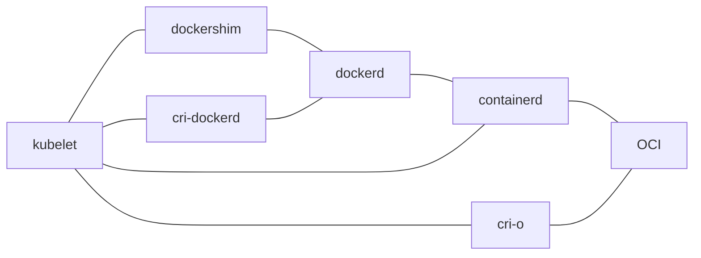
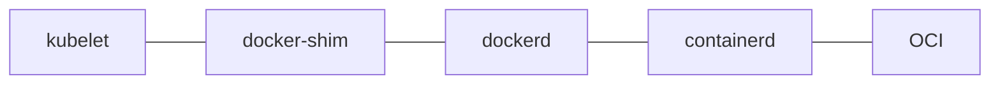
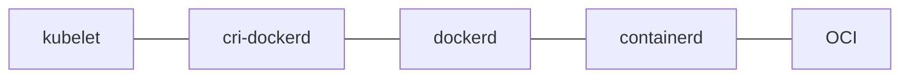
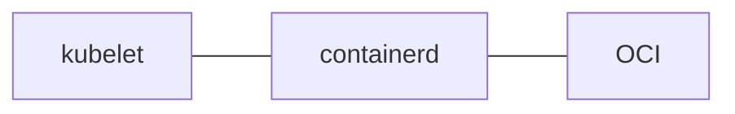
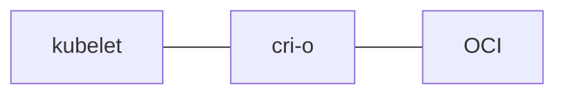

## 基本介绍

Kubernetes 是一个容器编排引擎, 或者说是一个容器实例与关联资源的管理框架, 你可以用它帮助你管理容器化的服务实例, 也可以基于这个框架定义新的集群资源并对资源的使用规则和代码实现进行自定义的开发, 让集群以你期望的形态运行.

## 趋势与好处

1. 部署密度增加, 提高资源利用率, 节约部署成本.
2. 提高部署效率, 基于 Kubernetes 实现微服务的快速部署与交付, 容器的批量调度与秒级启动.
3. 实现横向扩容, 灰度部署, 回滚, 链路追踪, 服务治理等.
4. 可根据业务负载均衡进行自动弹性伸缩.
5. 容器将环境和代码打包在镜像内, 保证了测试与生产运行环境的一致性.
6. 紧跟云原生社区技术发展步伐, 不给公司留技术债务, 为后期技术升级夯实了基础, 为个人储备前沿技术, 提高个人综合竞争力, 延长个人职业生涯周期.

 

## 文章链接

**上手文档**

上手教程 [学习 Kubernetes 基础知识 | Kubernetes](https://kubernetes.io/zh-cn/docs/tutorials/kubernetes-basics/)

官方文档 [Kubernetes 文档 | Kubernetes](https://kubernetes.io/zh-cn/docs/home/)

K8S 教程 [Kubernetes Tutorial | A Perfect Tutorial for Kubernetes Beginners (educba.com)](https://www.educba.com/software-development/software-development-tutorials/kubernetes-tutorial/)

**其他介绍文档**

架构摘选 [k8s系统架构图_六月的翅膀的博客-CSDN博客_k8s架构图](https://blog.csdn.net/cd_yourheart/article/details/107998070)

学习路线图(只看大纲即可) [2021年最新 Kubernetes / K8s 架构师学习路线_李振良的博客-CSDN博客](https://blog.csdn.net/zhenliang8/article/details/119457302)

## 从 Docker 迁移到 K8S

[【k8s】Kubectl 与 Docker 命令 对比_云川之下的博客-CSDN博客_kubectl和docker命令的区别](https://blog.csdn.net/m0_45406092/article/details/105006429)

[k8s containerd与docker命令使用对比 - 七月流星雨 - 博客园 (cnblogs.com)](https://www.cnblogs.com/scajy/p/15577909.html)

## 开发环境配置

[你好，Minikube | Kubernetes](https://kubernetes.io/zh-cn/docs/tutorials/hello-minikube/)

[Welcome! | minikube (k8s.io)](https://minikube.sigs.k8s.io/docs/)

## 生产环境架构图

## 运行时关系

docker 原有方案 (1.20 前) docker-shim 由 K8S 项目维护

docker 延续方案 (1.20 后) cri-dockerd 接替 docker-shim 但由 cri-dockerd 项目维护

containerd 方案 (趋势)

cri-o 方案

## 网络插件对比

## 存储服务对比
