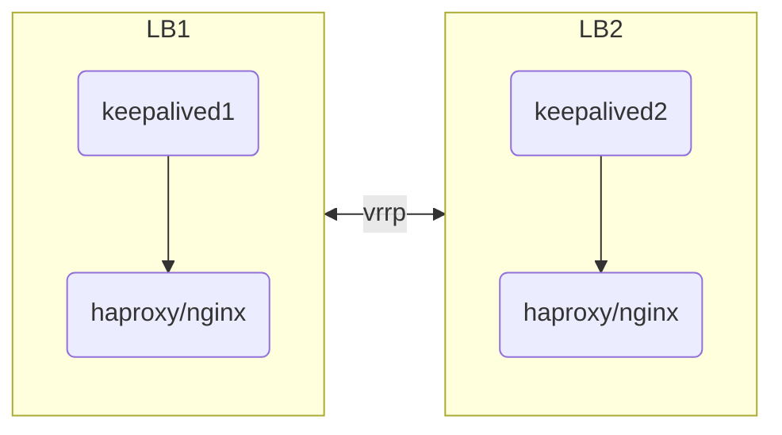
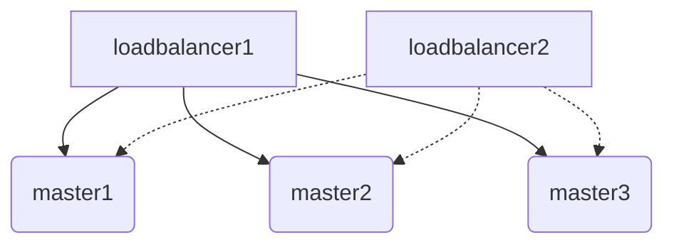
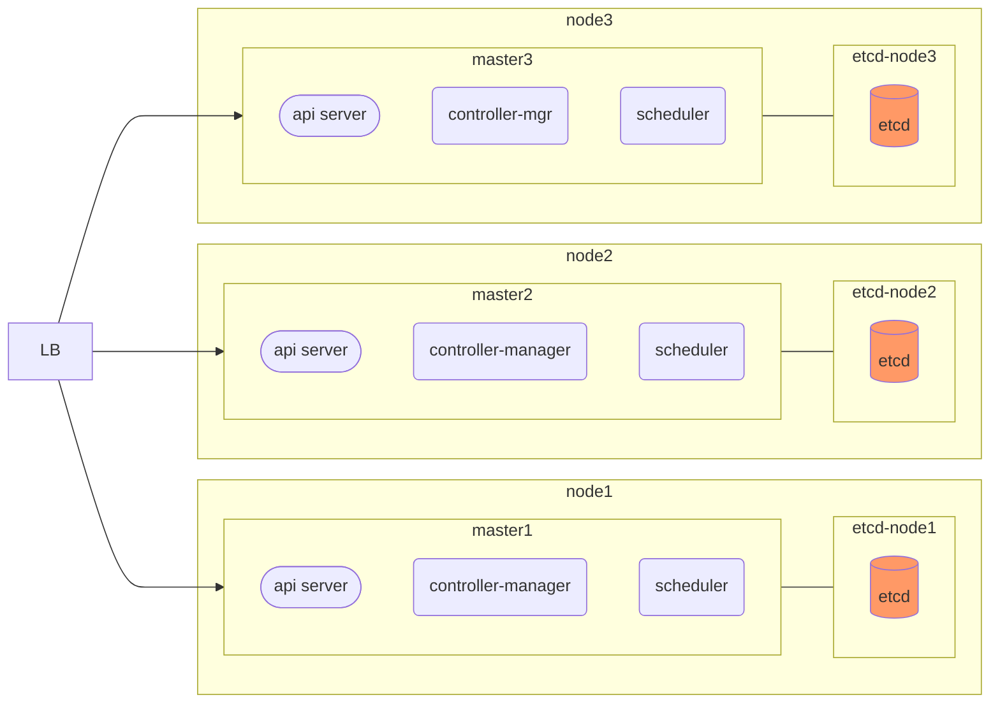
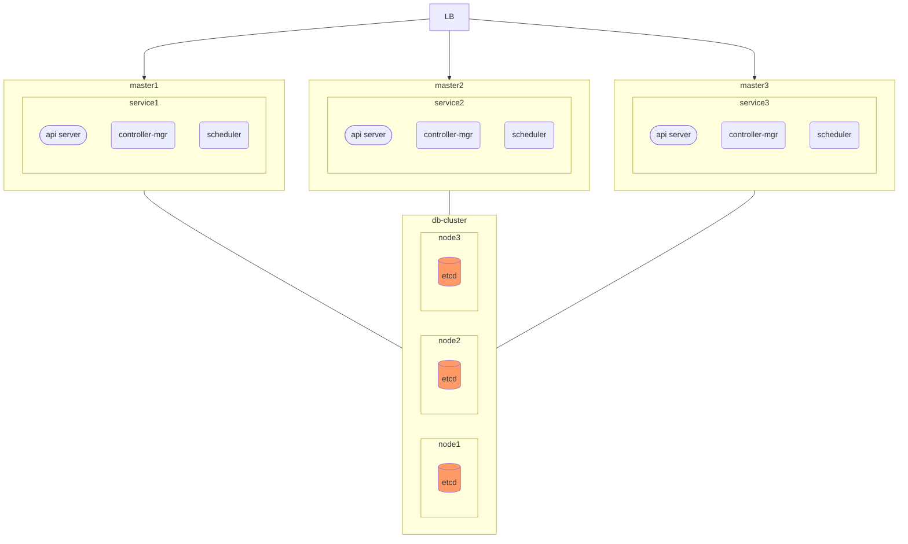

### K8S 高可用

K8S 高可用主要是两个层面的考虑:

1. ETCD 数据库的高可用
2. Master 组件的高可用

解决的方式主要是:

1. 多节点
2. 负载均衡

master 服务是无状态的, 所以扩增节点直接做负载均衡即可.

数据库通常是有状态的, 因此需要遵照数据库的多集群设计独立配置高可用.

#### 负载均衡高可用

结构图

公有云环境配置放行 keepalived 的 VRRP 协议有可能不方便, 或者不支持, 此时需要使用云服务商的负载均衡产品, 使用内网的负载均衡器即可.

私有云或数据中心环境, 可用直接使用 keepalived 配置高可用 VIP, 然后使用 HAproxy 或者 nginx 进行负载均衡配置即可.

负载均衡连接多个 master 结构图

#### ETCD 与 master 混合部署高可用(中小规模)

中小规模使用压力不大的情况下, 可用采用 ETCD 和 master 混部的方式, 同时共用基础设施, 支撑高可用服务.

#### 使用独立的 ETCD 集群(大集群)

因为 ETCD 数据库和 API-server 的压力并不是对等的, 对于更大的 K8S 集群可用独立的 ETCD 集群, 分别按需进行扩容维护, 以应对更大的压力.

