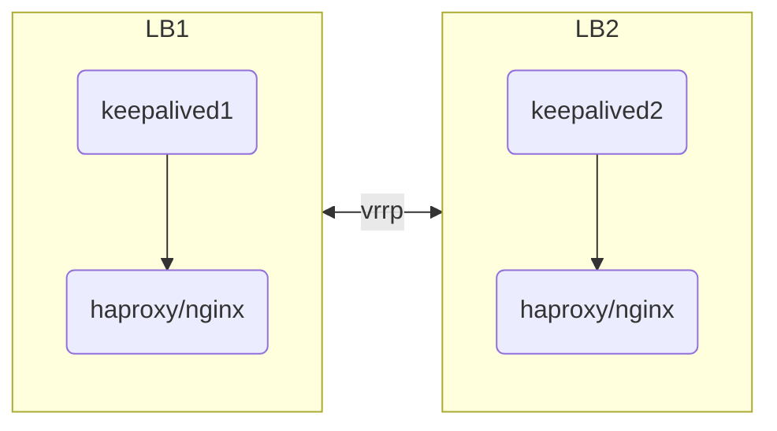
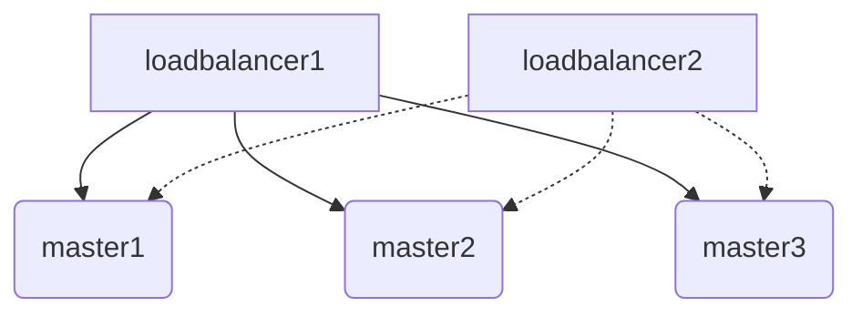
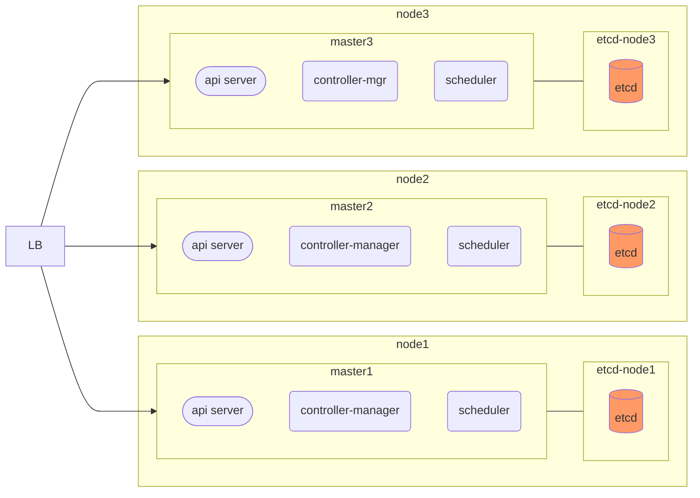
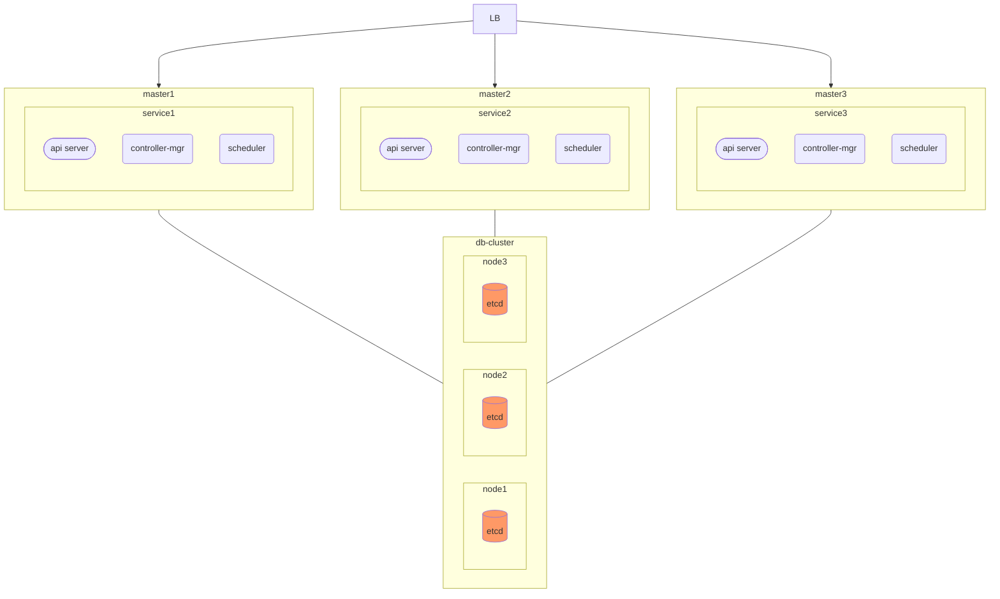
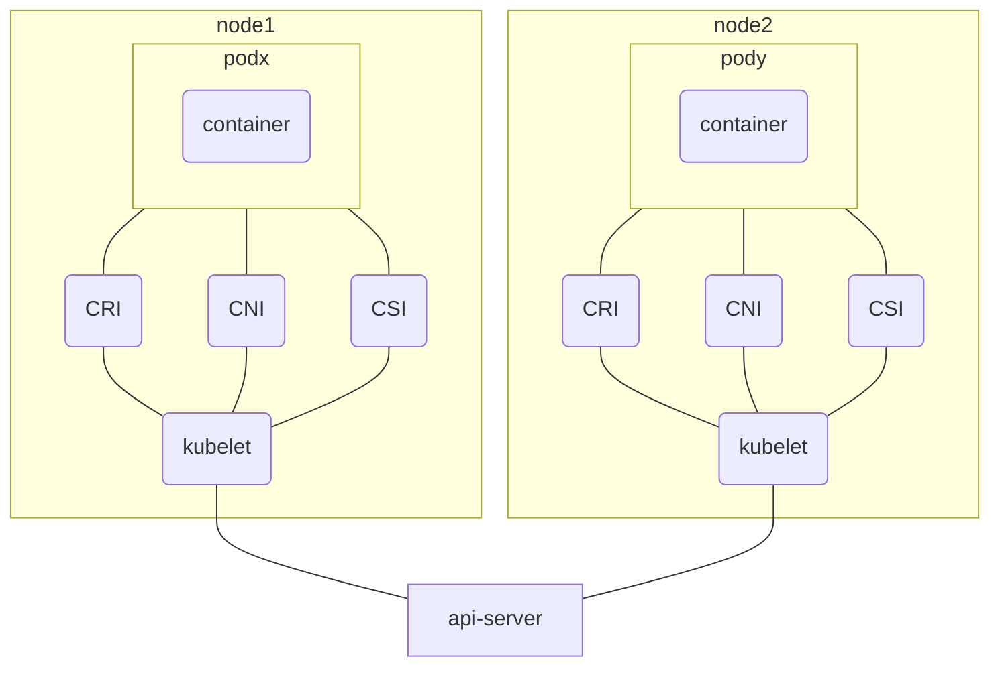

### Master 高可用

负载均衡高可用

```mermaid
flowchart LR
    subgraph LB1
    	k1(keepalived1)--> f1(haproxy/nginx)
    end
    subgraph LB2
    	k2(keepalived2)--> f2(haproxy/nginx)
    end
    LB1 <--vrrp--> LB2
```

多master结构图

```mermaid
flowchart
    loadbalancer1 --> m1(master1) & m2(master2) & m3(master3)
    loadbalancer2 -.-> m1(master1) & m2(master2) & m3(master3)
```

ETCD 与 master 混合部署高可用(中小规模)

```mermaid
flowchart LR
    subgraph node1
        subgraph master1
            a1([api server])
            c1(controller-manager)
            s1(scheduler)
        end
        subgraph etcd-node1
            d1[(etcd)]:::dbclass
        end
        master1 --- etcd-node1
    end
    subgraph node2
        subgraph master2
            a2([api server])
            c2(controller-manager)
            s2(scheduler)
        end
        subgraph etcd-node2
            d2[(etcd)]:::dbclass
        end
        master2 --- etcd-node2
    end
    subgraph node3
        subgraph master3
            a3([api server])
            c3(controller-mgr)
            s3(scheduler)
        end
        subgraph etcd-node3
            d3[(etcd)]:::dbclass
        end
        master3 --- etcd-node3
    end
    LB ---> master1 & master2 & master3
    classDef dbclass fill:#f96;
```

使用独立的 ETCD 集群(大集群)

```mermaid
flowchart TD
    subgraph master1
        subgraph service1
            a1([api server])
            c1(controller-mgr)
            s1(scheduler)
        end
    end
    subgraph master2
        subgraph service2
            a2([api server])
            c2(controller-mgr)
            s2(scheduler)
        end
    end
    subgraph master3
        subgraph service3
            a3([api server])
            c3(controller-mgr)
            s3(scheduler)
        end
    end
    LB ---> master1 & master2 & master3
    subgraph db-cluster
        subgraph node1
        	d1[(etcd)]:::dbclass
        end
        subgraph node2
        	d2[(etcd)]:::dbclass
        end
        subgraph node3
            d3[(etcd)]:::dbclass
        end
    end
    master1 & master2 & master3 --- db-cluster
    classDef dbclass fill:#f96;
```

节点

```mermaid
flowchart TD
    subgraph node1
        subgraph podx
            ct1(container)
        end
        c1(CRI)
        n1(CNI)
        s1(CSI)
        k1(kubelet)
        podx --- c1 & n1 & s1 --- k1
    end
    subgraph node2
        subgraph pody
            ct2(container)
        end
        c2(CRI)
        n2(CNI)
        s2(CSI)
        k2(kubelet)
        pody --- c2 & n2 & s2 --- k2
    end
    k1 & k2 --- api-server
```

