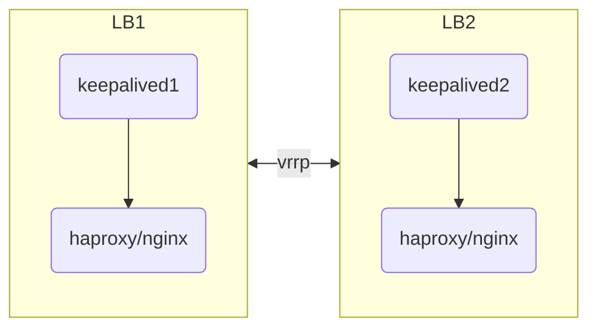
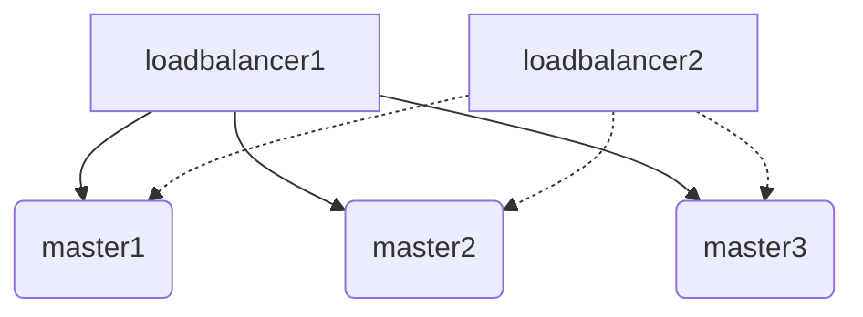
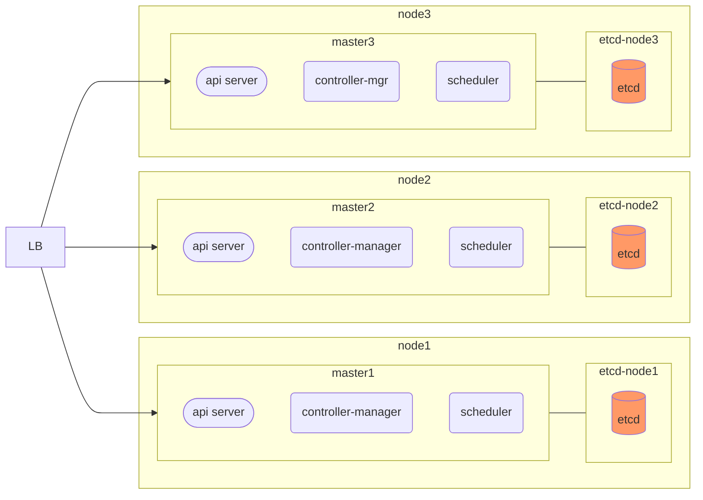
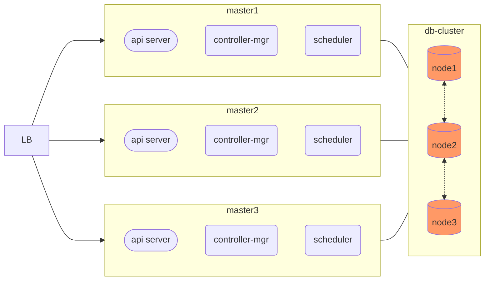

### K8S 高可用

控制面高可用服务拓扑 [高可用拓扑选项 | Kubernetes](https://kubernetes.io/zh-cn/docs/setup/production-environment/tools/kubeadm/ha-topology/)

K8S 高可用主要是两个层面的考虑:

1. ETCD 数据库的高可用
2. Master 组件的高可用

解决的方式主要是:

1. 多节点
2. 负载均衡

master 服务是无状态的, 所以扩增节点直接做负载均衡即可.

数据库通常是有状态的, 因此需要遵照数据库的多集群设计独立配置高可用.

### 整体节点拓扑结构图

#### 负载均衡高可用

结构图

公有云环境配置放行 keepalived 的 VRRP 协议有可能不方便, 或者不支持, 此时需要使用云服务商的负载均衡产品, 使用内网的负载均衡器即可.

私有云或数据中心环境, 可用直接使用 keepalived 配置高可用 VIP, 然后使用 HAproxy 或者 nginx 进行负载均衡配置即可.

负载均衡连接多个 master 结构图

#### ETCD 与 master 混合部署高可用(中小规模)

中小规模使用压力不大的情况下, 可用采用 ETCD 和 master 混部的方式, 同时共用基础设施, 支撑高可用服务.

#### 使用独立的 ETCD 集群(大集群)

因为 ETCD 数据库和 API-server 的压力并不是对等的, 对于更大的 K8S 集群可用独立的 ETCD 集群, 分别按需进行扩容维护, 以应对更大的压力.

### 节点的配置规格

节点配置清单

| 角色      | 数量        | 测试配置(最低)      | 拟生产配置(最低)                         | OS(最小化安装)       |
| --------- | ----------- | ------------------- | ---------------------------------------- | -------------------- |
| LB        | 2           | 1C-512M-5G          | 4C-8G-40G                                | Rocky9+              |
| harbor    | 测试1/生产3 | 1C-1G-15G           | 4C-8G-1T                                 | Rocky9+              |
| master    | 3           | 2C-4G-20G           | 8C-16G-40G                               | Ubuntu22.04+/Rocky9+ |
| node      | 3~100       | 4C-8G-20G           | 8C-16G-40G                               | Ubuntu22.04+/Rocky9+ |
| etcd      | 3以上的基数 | 1C-1G-15G           | 4C-8G-40G                                | Rocky9+              |
| rook-node | 3+          | 4C-8G-20G  10Gx2 | 16C-32G, 300Gx2  SSD:HD<=1:6 (物理机) | Rocky9+              |

> 测试环境可以将 LB 与 master 节点共用, 生产环境下, 则应当使用独立的节点
>
> 小规模生产master 可以与 etcd 节点共用

其他扩展配套服务需要独立规划, 如

1. 共享存储 Ceph/MinIO
2. 监控 Prometheus, grafana
3. 日志分析 ELK, Loki
4. 镜像仓库 Harbor
5. Node DNS

### 集群节点部署流程

1. 依赖服务配置

   1. 为 api-server 配置 LB服务器

   2. 配置 Harbor 服务器

2. 系统环境准备

   1. 每个节点 集群系统环境准备

   2. 网络软件源，镜像仓库源

3. 服务软件包安装

   1. 所有节点， CRI 安装（containerd）

   2. 所有节点， 三件套， kubeadm， kubelet， kubectl（node选装）

4. 集群控制平面初始化

   1. 第一个 master节点， kubeadm init 并验证master 状态

   2. 第一个 master节点， 安装网络插件

   3. 其他 master节点， 运行kubeadm join， 加入控制平面

5. Node(计算)节点初始化

   1. 所有 node节点， kubeadm join， 加入集群并验证node节点状态

6. 服务测试

   1. 创建pod并启动容器测试访问

   2. 测试服务网络通信

