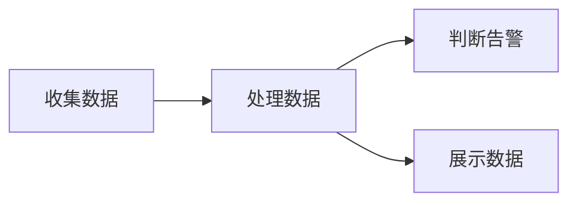

### 基本架构

如图所示

- prometheus 服务器， 监控数据处理核心， 控制获取， 存储， 查询
- Exporter 数据源， 通过 pull/push 将数据传输到 服务器
- dashboard 监控界面，通过 WebUI 将数据展示给用户
- AlertManager 报警管理器， 执行报警规则， 对接消息驱动

方案整体流程

Prometheus 在这个基本流程的基础上提供了一整套可行的解决方案, 并且形成了一整套生态, 可以极大的降低研发成本, 满足监控诉求并快速落地.